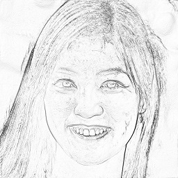
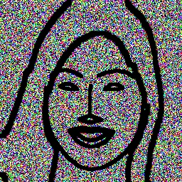

# PencilFace
 convert a pencil face to a real face

 # Data preperation

 ## 1. [Face Segmentation](https://github.com/kampta/face-seg) (it is really fast)

 ## 2. Use [convert.py](./convert.py) to get a lined face(with or without salt&pepper noise). Use [pencil.py](./pencil.py) to get a pencilled face

|  origin   | pencilface  |linedface  |
|  ----  | ----  |----  |
|   |  | |
