<!--
 * @Descripttion: 
 * @version: 
 * @Author: xiaoshuyui
 * @email: guchengxi1994@qq.com
 * @Date: 2021-04-18 08:57:36
 * @LastEditors: xiaoshuyui
 * @LastEditTime: 2021-04-25 11:44:49
-->
# PencilFace
 Convert a hand-painted face to a real face. It is a two-phase method with [U-GAT-IT](https://github.com/znxlwm/UGATIT-pytorch). First , convert simple-hand-painted faces to complex-hand-painted faces(short for a2b ). Then, convert complex-hand-painted faces to real faces(short for b2c).

 # Data preperation

 ## 1. [Face Segmentation](https://github.com/kampta/face-seg) (it is really fast)

 ## 2. Use [convert.py](./convert.py) to get a simple-hand-painted face(with or without salt&pepper noise). Use [pencil.py](./pencil.py) to get a complex-hand-painted face

|  origin   | complex-hand-painted  |simple-hand-painted  |
|  ----  | ----  |----  |
|   |  | |

 ## 3. 'origin'(a),'complex-hand-painted'(b),'simple-hand-painted'(c) are the three training data. Use 'a' and 'b' to train the a2b model. Use 'b' and 'c' to train the b2c model, respectively. a2b training data can be found here [Google Drive Link](https://drive.google.com/file/d/1ZyZn5dx6QIJnksJyoLGVhbQgolczCU86/view?usp=sharing), b2c training data can be found here [Google Drive Link](https://drive.google.com/file/d/1OMq2WuOHmtFTRDA6xuKf0KPjmgaor3GH/view?usp=sharing).

# Results

## Notice. 

Phase a2b trained only 10000 times iteration, phase b2c only trained 9000 times iteration. More training should have better results. 

## Training results(two phases with same training dataset)

| a2b10000  |b2c9000|
| ----  |----  |
| ||

## Testing results

|  origin   | a2b  |b2c  |
|  ----  | ----  |----  |
|  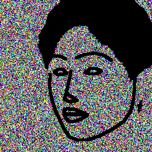 | 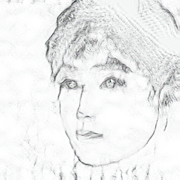 |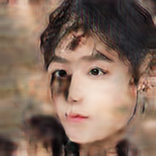  |
|  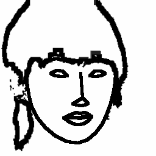 | 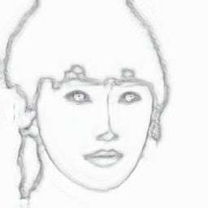 |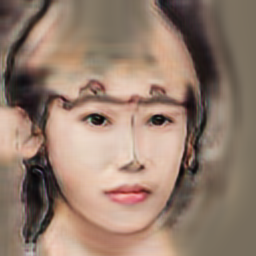  |
|  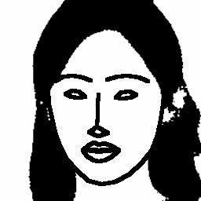 | 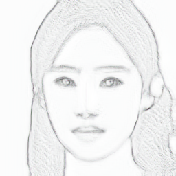 |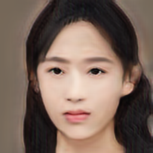  |
|  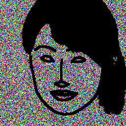 | 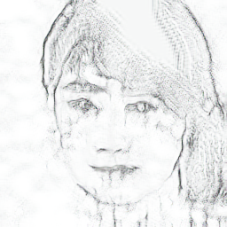 |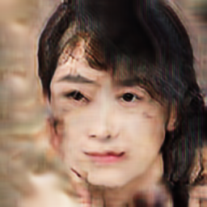  |
|  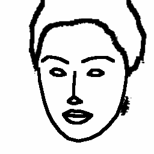 | 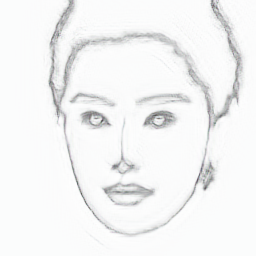 |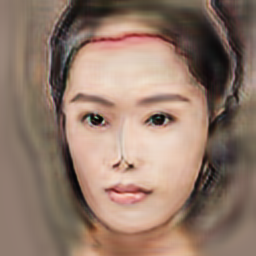  |
|  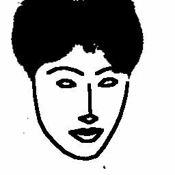 | 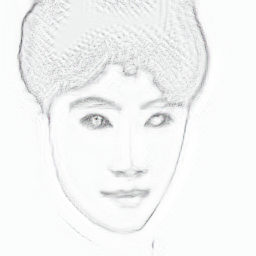 |  |
|  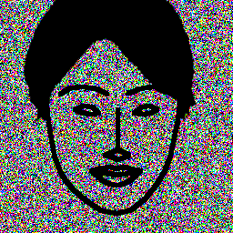 | 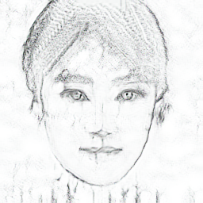 |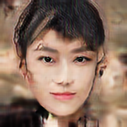  |
|   | 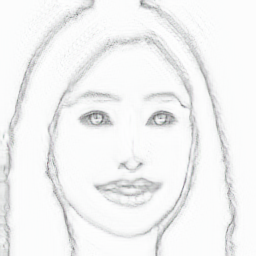 |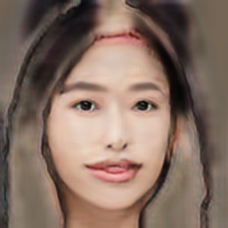  |
|  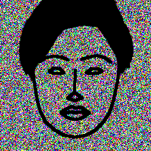 | 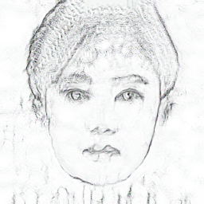 |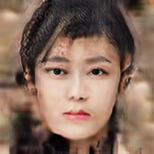  |
|  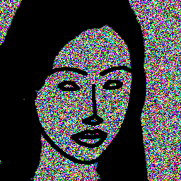 | 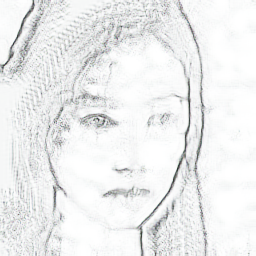 |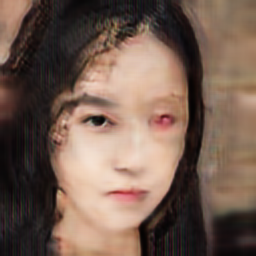  |
